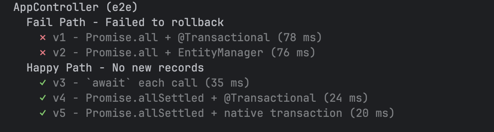
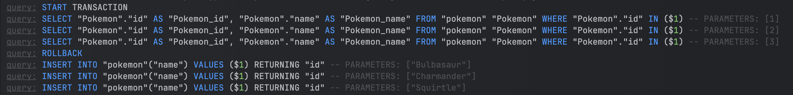
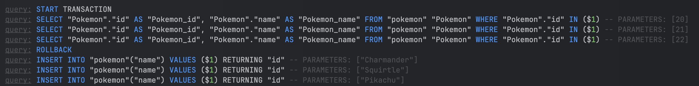
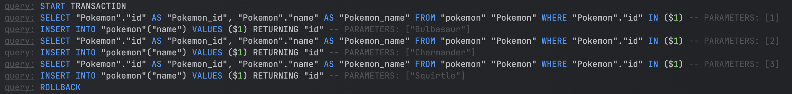
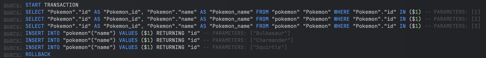
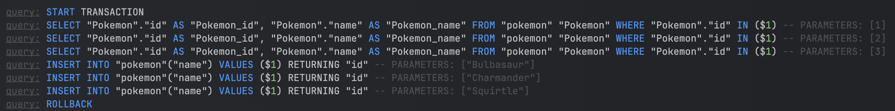

<p align="center">
  <a href="http://nestjs.com/" target="blank"></a>
</p>

[circleci-image]: https://img.shields.io/circleci/build/github/nestjs/nest/master?token=abc123def456
[circleci-url]: https://circleci.com/gh/nestjs/nest

  <p align="center">A sample application to test typeorm transactions.</p><p align="center">

## Description

A sample application to test typeorm transactions.

## Project setup

```bash
$ npm install
```

## Compile and run

```bash
# development
$ npm run start
```

## Run tests

```bash
# start docker (postgres)
$ docker compose up -d

# e2e tests
$ npm run test:e2e
```

## Approaches




### ❌ V1 - typeorm-transaction + Promise.all
```ts
  @Transactional()
  async createV1() {
    await Promise.all([
      this.save({ id: 1, name: 'Bulbasaur' }),
      this.save({ id: 2, name: 'Charmander' }),
      this.save({ id: 3, name: 'Squirtle' }),
      this.save({ id: 4, name: 'Pikachu' }, throwError),
    ]);
  }
```



### ❌ V2 - native typeorm transaction + Promise.all
```ts
  async createV2(): Promise<void> {
    await dataSource.transaction(async (entityManager) => {
      await Promise.all([
        this.saveEntityManager(entityManager, { id: 23, name: 'Bulbasaur' }, throwError),
        this.saveEntityManager(entityManager, { id: 20, name: 'Charmander' }),
        this.saveEntityManager(entityManager, { id: 21, name: 'Squirtle' }),
        this.saveEntityManager(entityManager, { id: 22, name: 'Pikachu' }),
      ]);
    });
  }
```



### ✅ V3 - wait individually + typeorm-transactional
```ts
  @Transactional()
  async createV3(): Promise<void> {
    await this.save({ id: 1, name: 'Bulbasaur' });
    await this.save({ id: 2, name: 'Charmander' });
    await this.save({ id: 3, name: 'Squirtle' });
    await this.save({ id: 4, name: 'Pikachu' }, throwError);
  }
```



### ✅ V4 - Promise.allSettled + typeorm-transactional
```ts
  @Transactional()
  async createV4(): Promise<void> {
    const settledPromises = await Promise.allSettled([
      this.save({ id: 1, name: 'Bulbasaur' }),
      this.save({ id: 2, name: 'Charmander' }),
      this.save({ id: 3, name: 'Squirtle' }),
      this.save({ id: 4, name: 'Pikachu' }, throwError),
    ]);

    rejectOrResolve(settledPromises);
  }
```



### ✅ V5 - Promise.allSettled + typeorm native transaction
```ts
  async createV5(): Promise<void> {
    await dataSource.transaction(async (entityManager) => {
      const promises = await Promise.allSettled([
        this.saveEntityManager(entityManager, { id: 1, name: 'Bulbasaur' }),
        this.saveEntityManager(entityManager, { id: 2, name: 'Charmander' }),
        this.saveEntityManager(entityManager, { id: 3, name: 'Squirtle' }),
        this.saveEntityManager(entityManager, { id: 4, name: 'Pikachu' }, throwError),
      ]);
      rejectOrResolve(promises);
    });
  }
```



## License

Nest is [MIT licensed](https://github.com/nestjs/nest/blob/master/LICENSE).
